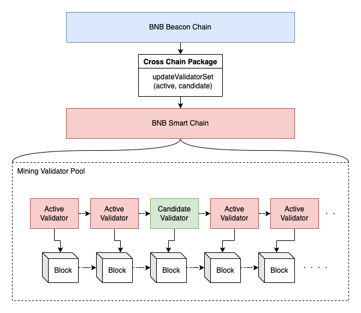
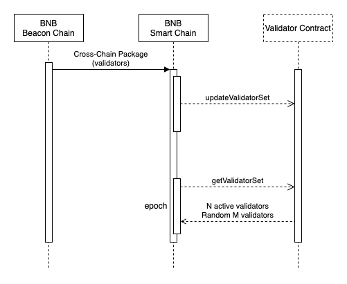

# BEP-131: Increase the liveness and robustness

- [BEP-131: Increase the liveness and robustness](https://github.com/bnb-chain/BEPs/pull/131)
    - [1. Summary](#1-summary)
    - [2. Abstract](#2-abstract)
    - [3. Status](#3-status)
    - [4. Motivation](#4-motivation)
    - [5. Specification](#5-specification)
    - [6. License](#6-license)

## 1. Summary

This BEP introduces candidate validators onto BNB Smart Chain to improve the liveness and robustness of the network.

## 2. Abstract

BNB Smart Chain will introduce more validators, e.g. another 20 inactive validators, into the validator set as backups, which will be called "Candidates".

Candidates will produce blocks and charge gas fees on BNB Smart Chain mainnet, but in a much less chance than the active validator set of 21 elected. A decent motivation is expected to be maintained so that the candidate validators are willing to ensure the quality and help secure BNB Smart Chain.

## 3. Status

This BEP is a draft.

## 4. Motivation

Nowadays, BNB Smart Chain has 21 active validators and many inactive validators. The inactive validators have no reward so the incentive for the runner to ensure the node quality and the delegation from the BNB holders are not enough.

In order to decentralize the network further, more validators should be introduced. Besides increasing the anti-censorship, it always increases the robustness and availability of the network. BNB Smart Chain should survive even if more than half of the validator set were censored or taken down in an either incidental or hostile way.

## 5. Specification

### 5.1 Overview

In the current version, the BSC validator set is determined by its staking and delegation logic, via a staking module built on BNB Beacon Chain for BSC, and propagated every day UTC 00:00 from BNB Beacon Chain to BSC via Cross-Chain communication.

Based on this implementation, the BNB Beacon Chain can propagate more validators to BSC, and BSC can adopt a flexible strategy to choose working validators from both the top 21 staked active validators and less staked candidates for each epoch.

In this way, the robustness and liveness of the BNB Smart Chain can be improved, and more validator operators will be motivated to join.

### 5.2 Workflow
Following is a simple diagram to explain the workflow of the validator setting and getting. Usually, M is smaller than N so that candidates get less chance to propose blocks.


### 5.3 Roles
  1. Cabinet
    The top 21 stake validators in daily election snapshots get the most chance of producing blocks.
  2. Candidate
    The top (21, 21+ MaxNumOfCandidates] staked validators in daily election snapshots get a small chance to produce blocks.
  3. Inactive
    The rest validators get no chance to produce validators.

### 5.4 Cross Chain Package
BNB Beacon Chain will send the cabinet and candidate validator set information to the validator contract on BNB Smart Chain every day through the cross-chain package.

### 5.5 Election

During the consensus process, BNB Smart Chain will reacquire 21 new working validators through the interface getValidators of validator contract every epoch. On this basis, we can adopt a flexible strategy in the getValidators to achieve the goals.

#### Election Strategy
First select N validators randomly from Cabinet, and then select M validators randomly from the unselected Cabinet validator and candidates, and finally form a group of 21 validators.

In order to ensure that the randomness can not be manipulated, epochNumber = BlockHeight / 200 is chosen as the random source. epochNumber is a fixed value within one epoch and is incremental across the epoch.

Following is the simplified pseudocode demonstrate how the election works:

```
Function Select(cabinet, candidate, M)
   Shuffle(cabinet, M)
   // put unselected cabinet validator into candidates
   candidate = [cabinet[0:M], candidate]
   Shuffle(candidate, M)
   return [cabinet[M:], candidate[0:M]]
       
Function Shuffle(validators, limit)
    n = len(validators)
    for i <- 0 to limit-1
        idx = keccak256(epochNumber+validators[i].consensusAddr) mod n
        // Do swap 
        validators[i], validators[idx] = validators[idx], validators[i]
```

When the total number of available validators is less than 21, the random selection rule will not be applied.

### 5.5.1 Governance
The following parameters can be governed:
1. MaxNumOfCandidates: The max number of candidates can be elected each day on the BNB Chain Staking module. We can gradually increase the value of MaxNumOfCandidates when there is enough ready candidates.
2. MaxNumOfWorkingCandidates: The max number of candidates can be randomly selected to be working validators for each epoch on the BNB Smart Chain.
### 5.6 Security
A higher staked validator is more trustworthy. Based on this assumption, we let the Top 21 validators generate blocks in turn to maintain a certain degree of security, and the other validators are randomly selected to ensure that these validators will not collude and cause damage to the overall network.

### 5.7 Liveness
In addition to Cabinet validators, Candidate validators can get the opportunity to propose blocks and get rewards accordingly. Through the reward mechanism, Candidates can be more motivated to actively maintain the nodes. On the other hand, all the slash rules also work on Candidate validators to ensure the malicious or negative behaviors from Candidates  will be punished.     

Cabinet and Candidates will be randomly chosen to form the 21 working validators each epoch. The liveness of the network is usually decided by Cabinet validators who are the majority of the working validators. It means the network is still alive even if a large percentage of Candidates go offline. However, the network still suffers a liveness crisis if the majority of Cabinet go offline. 

### 5.8 Robustness
Through the new mechanism, BNB Smart Chain no longer has only 21 validators but has more candidates to choose from. When any active validators encounter instability problems, they can be replaced by candidates, thereby improving the overall robustness.

## 6. License

The content is licensed under [CC0](https://creativecommons.org/publicdomain/zero/1.0/).
